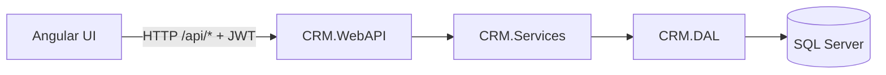

# Architecture

## High-Level Layering

- CRM.WEB (Angular): UI + route guards + API calls
- CRM.WebAPI (ASP.NET Core): HTTP endpoints, auth, DTOs, middleware
- CRM.Services: business logic (domain services)
- CRM.DAL: persistence and repositories (EF Core + Dapper)
- CRM.Entities: domain models
- CRM.Database: SQL Server schema and stored procedures
- CRM.Worker: background sync that uses services to read/write CRM data

## Request Flow (UI → API → DB)

## Authentication

1. User logs in via `POST /api/login`.
2. Backend validates credentials via ASP.NET Identity and returns a JWT token with role claims.
3. Angular stores the token (see [AuthService](../CRM.WEB/src/app/core/services/auth.service.ts)) and attaches it to requests via [auth.interceptor.ts](../CRM.WEB/src/app/core/interceptors/auth.interceptor.ts).
4. Angular route access is enforced via [role.guard.ts](../CRM.WEB/src/app/core/guards/role.guard.ts) using roles in [app.routes.ts](../CRM.WEB/src/app/app.routes.ts).

## Error Handling

The API uses a global exception middleware:

- [ExceptionMiddleware](../CRM.WebAPI/Middlewares/ExceptionMiddleware.cs)

Business rules can be represented as [BusinessException](../CRM.Core/Exceptions/BusinessException%20.cs) to return a controlled HTTP status code and message.

## Data Access Strategy

Two read/write approaches exist:

- EF Core:
  - [DataContext](../CRM.DAL/DBContexts/DataContext.cs) for CRM data
  - [SecurityDbContext](../CRM.DAL/SecurityDbContext.cs) for Identity/security data (schema `sec`)
- Dapper + stored procedures:
  - Base class: [RepositoryBaseDapper](../CRM.DAL/GenericRepository/RepositoryBaseDapper.cs)
  - Used for optimized reads and specific queries (example: prospects list via stored procedure)

## Background Jobs (Worker)

The worker periodically runs sync operations:

- Loop: [Worker](../CRM.Worker/workers/Worker%20.cs)
- Orchestration: [SyncService](../CRM.Worker/services/SyncService.cs)
